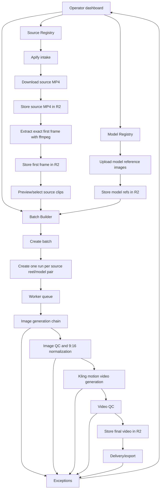

# AI Motion Video Engine - From-Scratch Technical Spec

## 1. Technical Objective

Build a durable internal production system that converts selected Instagram reels into registered-model AI motion videos.

The system must be:

- Durable: state survives process restarts and worker crashes.
- Idempotent: retries and webhook replays do not duplicate work.
- Observable: every run, stage, provider call, cost, asset, prompt, and exception is inspectable.
- Batch-capable: selected reels can be processed across multiple registered models.
- Provider-safe: external APIs are wrapped, typed, retried, and failure-classified.
- Operator-friendly: failures surface as actionable exceptions, not silent logs.

## 2. Recommended Stack

| Layer | Technology |
|---|---|
| Web app | Next.js App Router |
| UI | React, TypeScript, Tailwind |
| API | Next.js route handlers or separate Node API if preferred |
| Database | Postgres |
| ORM | Drizzle ORM |
| Storage | Cloudflare R2 |
| Worker queue | Durable Postgres-backed queue, Inngest, BullMQ, or equivalent |
| Source intake | Apify |
| Image generation | WaveSpeed |
| Video generation | WaveSpeed |
| Media processing | ffmpeg-static or bundled ffmpeg binary |
| Tests | Vitest/unit tests, integration tests for pipeline, Playwright for UI smoke |
| Deployment | Vercel/Railway/Fly/Render are acceptable if worker + ffmpeg + env requirements are met |

The exact hosting platform can vary, but the architecture must preserve the worker/runtime boundaries and ensure ffmpeg is available wherever media processing runs.

## 3. Architecture



## 4. Core Data Model

The developer may adjust column names, but the system needs these entities and relationships.

### `models`

Registered model/brand identities.

Required fields:

- `id`
- `slug`, unique
- `display_name`
- `status`: active, paused, archived
- `notes`
- timestamps

### `face_references`

Reference images for each registered model.

Required fields:

- `id`
- `model_id`
- `r2_key`
- `public_url` or resolvable URL helper
- `ordinal`
- `active`
- optional `embedding` for identity QC
- upload timestamp

Rules:

- A model should have at least 3 active references before it can be used in generation.
- Generation should use exactly 3 active references unless provider limits are reverified.

### `source_accounts`

Approved Instagram source accounts.

Required fields:

- `id`
- `handle`, unique
- `status`: active, paused, archived
- `apify_input_id` or equivalent config reference
- `last_scraped_at`
- optional account metadata

### `source_reels`

Candidate source clips imported from Instagram.

Required fields:

- `id`
- `shortcode`, unique
- `source_account_id`
- `reel_url`
- `caption`
- metrics: views, likes, comments, shares where available
- `duration_seconds`
- `posted_at`
- `ingested_at`
- `status`
- `mp4_r2_key`
- `first_frame_r2_key`
- `width`, `height`, optional but recommended
- `rank_payload`, optional

Statuses should include:

- `ingested`
- `asset_ready`
- `preview_ready`
- `selected`
- `rejected`
- `failed`
- `archived`

### `prompts`

Versioned prompt templates.

Required fields:

- `id`
- `stage`: image_gen or video_gen
- `scope`: global, model, source_account, or other future scope
- `scope_id`, nullable
- `version`
- `body`
- `active`
- `created_by`
- `created_at`

Rules:

- Prompt versions are immutable.
- Editing a prompt creates a new version.
- A run stores the rendered prompt text used at execution time.
- Only one active prompt per stage/scope/scope_id should exist.

### `batches`

A batch groups selected source clips and selected models.

Required fields:

- `id`
- `name`
- `status`
- `created_by`
- `created_at`
- `started_at`
- `finished_at`
- `operator_instruction`
- `settings_snapshot`

Statuses:

- `draft`
- `queued`
- `running`
- `paused`
- `completed`
- `completed_with_exceptions`
- `cancelled`

### `batch_items`

One batch item should map to one run, usually one source reel/model pair.

Required fields:

- `id`
- `batch_id`
- `source_reel_id`
- `model_id`
- `run_id`
- `status`
- `attempts`
- `last_error`

### `runs`

One generation attempt for one source reel and one model.

Required fields:

- `id`
- `source_reel_id`
- `model_id`
- `batch_id`, nullable for manual/debug runs
- `status`
- `current_stage`
- `cost_cents`
- `total_latency_ms`
- `started_at`
- `finished_at`
- `exception_id`

Required uniqueness:

- For normal production, avoid duplicate active runs for the same `batch_id`, `source_reel_id`, and `model_id`.
- For non-batch manual reruns, use an explicit rerun/version field if duplicates are allowed.

### `run_jobs`

Queue records.

Required fields:

- `id`
- `status`
- `source`
- `payload`
- `idempotency_key`, unique
- `attempts`
- `max_attempts`
- `available_at`
- `locked_by`, optional
- `locked_until`, optional
- `run_id`
- timestamps
- `error`

Statuses:

- `queued`
- `running`
- `succeeded`
- `retry_scheduled`
- `failed`
- `cancelled`

### `stage_runs`

Every provider/stage attempt inside a run.

Required fields:

- `id`
- `run_id`
- `stage`
- `attempt`
- `provider`
- `status`
- `cost_cents`
- `latency_ms`
- `request_payload`
- `response_payload`
- `prompt_stage`
- `prompt_scope`
- `prompt_version`
- `rendered_prompt`
- `output_r2_keys`
- `error`
- timestamps

This table is the main audit and debugging source for provider behaviour.

### `image_candidates`

Generated first-frame candidates.

Required fields:

- `id`
- `run_id`
- `ordinal`
- `provider`
- `r2_key`
- `normalized_r2_key`, optional if different
- `width`
- `height`
- `qc_payload`
- `qc_passed`
- `identity_score`
- `ocr_score`
- `composition_score`
- `combined_score`
- `is_winner`
- `cost_cents`
- `created_at`

### `video_renders`

Generated motion videos.

Required fields:

- `id`
- `run_id`
- `provider`
- `r2_key`
- `mime_type`
- `width`
- `height`
- `duration_seconds`
- `qc_payload`
- `qc_passed`
- `is_winner`
- `cost_cents`
- `created_at`

### `exceptions`

Operator-visible failures.

Required fields:

- `id`
- `run_id`, nullable if batch/source-level exception
- `batch_id`, optional
- `stage`
- `reason`
- `payload`
- `status`: open, resolved, dismissed
- `resolution_action`
- `resolved_by`
- `resolved_at`
- `created_at`

### `audit_log`

Immutable event stream for operator/system actions.

Required fields:

- `id`
- `actor_user_id`
- `action`
- `entity_type`
- `entity_id`
- `payload`
- `created_at`

### `assets`

Recommended, even if R2 keys are also stored on stage tables.

Required fields:

- `id`
- `asset_type`: model_ref, source_mp4, source_first_frame, generated_image, normalized_image, generated_video, qc_artifact
- `r2_key`
- `public_url`
- `mime_type`
- `size_bytes`
- `width`
- `height`
- `duration_seconds`
- `sha256`
- `created_at`

This makes asset availability checks and cleanup much easier.

## 5. R2 Storage Rules

Use deterministic, human-readable keys.

Recommended key structure:

```text
models/{model_slug}/refs/{ordinal}-{asset_id}.{ext}
sources/{source_account_handle}/{source_reel_shortcode}/source.mp4
sources/{source_account_handle}/{source_reel_shortcode}/first-frame.png
generated/{model_slug}/{source_reel_shortcode}/run-{run_id}/{provider}/candidate-{n}.png
generated/{model_slug}/{source_reel_shortcode}/run-{run_id}/{provider}/candidate-{n}-9x16.png
videos/{model_slug}/{source_reel_shortcode}/run-{run_id}/{provider}/final.mp4
qc/{model_slug}/{source_reel_shortcode}/run-{run_id}/{stage}/{artifact_name}.json
```

Rules:

- Store all provider inputs and outputs in R2.
- Persist R2 keys in the database.
- Do not rely on temporary Instagram CDN URLs after intake.
- Provider input URLs must be public or signed and reachable by WaveSpeed.
- Preflight provider input URLs before submitting generation jobs.
- Record asset size, MIME type, and dimensions where possible.

## 6. Source Intake With Apify

### Required intake flow

1. Operator starts intake for one or more active source accounts, or scheduled intake runs.
2. Backend calls Apify actor with approved account handles.
3. Backend receives Apify dataset/results.
4. Backend extracts candidate reels.
5. Backend dedupes by Instagram shortcode.
6. Backend immediately downloads the best available video URL.
7. Backend uploads source MP4 to R2.
8. Backend extracts first frame with ffmpeg.
9. Backend uploads first frame to R2.
10. Backend marks source reel as preview-ready.
11. UI shows playable preview from R2.

### Known failure modes

| Failure | Mitigation |
|---|---|
| Apify returns reels with no downloadable MP4 | Store source-level exception with shortcode and raw candidate metadata. |
| Instagram CDN URL expires before download | Download immediately during intake, retry quickly, never defer source download until generation time. |
| ffmpeg missing in runtime | Bundle ffmpeg-static or provide explicit `FFMPEG_PATH`; test at startup. |
| Source video is not vertical | Store it but mark suitability warning; prevent automatic generation unless allowed. |
| Duplicate reel appears across runs | Enforce unique shortcode. |
| Source MP4 R2 URL returns 404 | Asset preflight must fail intake/generation before provider call. |

## 7. ffmpeg Requirements

ffmpeg is required for:

- Extracting exact first frame from source MP4.
- Reading dimensions/duration.
- Normalizing generated images to exact 9:16.
- Optional video validation/transcoding.

Rules:

- Do not depend on system ffmpeg being installed on the developer's laptop or production host.
- Use `ffmpeg-static` or ship a bundled binary.
- Ensure the worker runtime can execute the binary.
- Expose `FFMPEG_PATH` override for production.
- Add a startup/readiness check that verifies ffmpeg can run.

First-frame extraction should be deterministic, for example:

```text
ffmpeg -i source.mp4 -frames:v 1 first-frame.png
```

Image normalization should guarantee exact 9:16 dimensions before video generation. The exact resolution can be chosen, but it should be consistent, for example 1080x1920 or a higher 9:16 equivalent.

## 8. WaveSpeed Provider Integration

All WaveSpeed HTTP calls must go through typed provider clients. No raw provider calls should exist in route handlers or UI components.

### Image provider chain

1. `wavespeed_nano_banana_pro`
   - Model: `google/nano-banana-pro/edit-multi`
   - Primary image model.
2. `wavespeed_flux_kontext_max`
   - Model: `wavespeed-ai/flux-kontext-max/multi`
   - First fallback.
3. `wavespeed_seedream_v45`
   - Model: `bytedance/seedream-v4.5/edit`
   - Second fallback.

### Video provider

1. `wavespeed_kling_v3_standard`
   - Model: `kwaivgi/kling-v3.0-std/motion-control`
   - Primary motion-control provider.

### Disabled future slot

- `wavespeed_kling_v3_pro`
  - Must remain disabled unless explicitly enabled after commercial/quality verification.

### Image input rules

For image generation, send:

1. Model reference 1
2. Model reference 2
3. Model reference 3
4. Source first frame

Do not send more than 4 image URLs unless the exact endpoint is reverified.

Known issue to account for:

- WaveSpeed image APIs may reject `image_urls` arrays longer than 4.
- Nano Banana Pro may reject `aspect_ratio: 9:16`; use a supported aspect ratio such as `2:3` if required, then normalize to exact 9:16 after download.

### Provider execution rules

- Record the provider request payload.
- Record provider response payload.
- Record provider latency.
- Record cost estimate and actual cost when available.
- Download provider outputs to R2 immediately.
- Do not depend on provider-hosted output URLs remaining available.
- Classify errors into typed categories:
  - auth
  - rate_limit
  - provider_timeout
  - provider_unavailable
  - content_block
  - invalid_input
  - malformed_response
  - asset_download_failed
  - unknown

## 9. Prompt Versioning And Rendering

Prompting is core system logic.

Required behaviour:

- Store prompt templates in Postgres.
- Maintain immutable versions.
- Have separate prompt stages for image and video.
- Support global prompts first.
- Support model-specific overrides later.
- Render variables before provider execution.
- Save rendered prompt text on `stage_runs`.
- Save operator instruction separately and include it in rendered prompt through `{{run_instruction_block}}`.
- Allow rollback by activating an older prompt version, not by editing history.

Required prompt variables:

- `{{model_slug}}`
- `{{model_display_name}}`
- `{{source_reel_shortcode}}`
- `{{source_reel_url}}`
- `{{run_instruction_block}}`

Every run detail view should show exactly which prompt version and rendered prompt were used.

## 10. Run State Machines

### Run status

Recommended statuses:

- `queued`
- `started`
- `image_gen`
- `image_qc`
- `video_gen`
- `video_qc`
- `delivering`
- `delivered`
- `exception`
- `cancelled`

### Stage status

Recommended statuses:

- `pending`
- `running`
- `success`
- `retry`
- `failed`
- `skipped`

### Batch status

Recommended statuses:

- `draft`
- `queued`
- `running`
- `paused`
- `completed`
- `completed_with_exceptions`
- `cancelled`

## 11. Worker Queue And Resumability

The worker must be able to resume safely after interruption.

Rules:

- Every job must have an idempotency key.
- Claiming a job must be atomic.
- A stuck running job must become retryable after a lock timeout.
- A run should inspect persisted stage state before repeating work.
- Completed stages should not be rerun unless the operator explicitly retries that stage.
- Provider outputs should be downloaded and persisted before stage success is recorded.
- A run can resume from the next incomplete stage.

Example resume logic:

```text
if source assets are missing -> exception
if winning normalized image exists -> skip image_gen and image_qc
if final video exists -> skip video_gen
if delivery exists -> mark delivered
otherwise continue from first missing required artifact
```

## 12. Retry Policy

Recommended defaults:

| Failure type | Action |
|---|---|
| Auth/config error | Do not retry automatically; open exception. |
| R2 input 404 | Do not retry provider; open asset exception. |
| Apify no downloadable video | Do not retry endlessly; surface source exception. |
| Provider timeout | Retry with backoff, then fallback if image stage. |
| Rate limit | Retry with backoff and concurrency throttling. |
| Content block | Try next image provider if available; if all blocked, open exception. |
| Wrong output dimensions | Normalize if possible; if impossible, try next provider or open QC exception. |
| Worker crash | Resume from persisted state. |
| QC fail | Retry generation once with same prompt/provider chain; after repeat fail, open exception. |

Image generation can fall through the provider chain. Video generation has one active provider, so failure usually becomes retry/backoff, then exception.

## 13. Batch Controls

The Batch Builder must allow:

- Selecting multiple preview-ready source clips.
- Selecting one or more active registered models.
- Choosing active prompt versions.
- Adding optional operator instruction.
- Seeing how many runs will be created before queueing.
- Seeing estimated cost before queueing.
- Setting concurrency or priority if needed.

Batch execution should show:

- Total runs.
- Queued/running/succeeded/failed counts.
- Current active stages.
- Open exceptions.
- Cost so far.
- Provider usage.
- Ability to pause new work.
- Ability to retry failed items.
- Ability to resume an interrupted batch.

Batch item retry should not duplicate successful runs.

## 14. Quality Control And Drift Detection

Quality control should start pragmatic and become stricter as real outputs accumulate.

### Image QC

Minimum checks:

- Generated image exists in R2.
- MIME type is image/png or expected image format.
- Image is normalized to exact 9:16.
- Face/identity similarity is above threshold where feasible.
- OCR text from source first frame is preserved where visible.
- Generated image does not add extra people.
- Source composition is broadly preserved.

Recommended automated signals:

- Face embedding similarity between generated image and model references.
- Perceptual hash or image similarity against source first frame for composition.
- OCR diff for visible text.
- VLM scoring for prompt compliance.
- Dimension/aspect-ratio check.

### Video QC

Minimum checks:

- Final video exists in R2.
- MIME type is video/mp4 or expected format.
- Width/height are exact 9:16.
- Duration is within acceptable tolerance of source.
- Video is playable.
- No obvious provider error frame/blank output.
- Optional audio exists if source audio is required.

Recommended automated signals:

- ffprobe duration/dimensions.
- Frame sampling for blank/corrupt frames.
- OCR preservation on sampled frames.
- VLM sampled-frame scoring.
- Identity consistency across sampled frames.
- Motion/duration consistency against source.

### Drift detection

Track these over time:

- Image QC pass rate by provider and prompt version.
- Video QC pass rate by provider and prompt version.
- Identity similarity average by model.
- OCR preservation average.
- Operator rejection rate.
- Retry rate.
- Content block rate.
- Provider latency.
- Provider cost per successful output.
- Percentage of outputs needing human review.

Silent quality drift is real. If provider output quality changes but API calls still succeed, these metrics should show degradation before operators have to manually inspect every output.

## 15. API Surface

Exact route names can vary, but the app needs these capabilities.

### Models

- `GET /api/models`
- `POST /api/models`
- `PATCH /api/models/:id`
- `POST /api/models/:id/references`
- `DELETE /api/models/:id/references/:referenceId`

### Source accounts and intake

- `GET /api/source-accounts`
- `POST /api/source-accounts`
- `PATCH /api/source-accounts/:id`
- `POST /api/intake/run`
- `GET /api/source-reels`
- `PATCH /api/source-reels/:id`

### Prompts

- `GET /api/prompts`
- `POST /api/prompts`
- `POST /api/prompts/:id/activate`

### Batches and runs

- `POST /api/batches`
- `GET /api/batches`
- `GET /api/batches/:id`
- `POST /api/batches/:id/start`
- `POST /api/batches/:id/pause`
- `POST /api/batches/:id/resume`
- `POST /api/batches/:id/retry-failed`
- `GET /api/runs`
- `GET /api/runs/:id`
- `POST /api/runs/:id/retry-stage`

### Operations

- `GET /api/providers`
- `GET /api/health`
- `GET /api/exceptions`
- `PATCH /api/exceptions/:id`
- `GET /api/audit-log`
- `GET /api/metrics/summary`

## 16. UI Surface

Required dashboard panels:

- Health/status header
- Provider Operations
- Model Registry
- Source Registry
- Intake controls
- Source preview grid with playable videos
- Batch Builder
- Prompt Operations
- Queue/worker controls
- Run History
- Run Detail
- Exception Center
- Audit Log
- Metrics/cost summary

Run Detail must show:

- Source video preview
- Extracted first frame
- Model references used
- Rendered image prompt
- Image provider attempts
- Generated image candidates
- Winning normalized generated image
- Rendered video prompt
- Video provider attempt
- Final video output
- QC results
- Exceptions
- Audit events
- Artifact checks

## 17. Security And Access

Minimum requirements:

- API keys only in environment variables.
- Never expose provider keys to the browser.
- R2 public URLs should expose only assets intended for provider download or operator preview.
- If using public R2 dev URLs, understand that anyone with the URL can fetch the asset.
- Production should consider signed URLs or a public asset gateway if needed.
- Validate uploads by MIME type and size.
- Rate-limit expensive endpoints.
- Require auth before production use.

## 18. Observability

The dashboard and logs must answer:

- What is running right now?
- What failed?
- Why did it fail?
- Which provider failed?
- Which prompt version was used?
- Which inputs were sent?
- Which outputs were stored?
- How much did this cost?
- Can this safely be retried?
- Which batches are blocked?

At minimum, record structured logs for:

- Intake start/finish/fail
- Asset download/upload
- ffmpeg extraction/normalization
- Provider request/response/fail
- QC pass/fail
- Queue claim/retry/fail
- Operator actions

## 19. Required Tests

Minimum automated tests:

- Prompt rendering and version selection.
- Provider config order.
- WaveSpeed payload construction.
- R2 key generation.
- Asset URL preflight behaviour.
- ffmpeg path/readiness helper.
- First-frame extraction wrapper with fixture video.
- Image normalization wrapper.
- Run state transitions.
- Queue idempotency.
- Batch item generation counts.
- Retry policy classification.
- Exception creation.
- Run detail response shape.

Minimum manual smoke tests:

- Create model with 3 reference images.
- Add source account.
- Run Apify intake.
- Confirm source MP4 and first frame exist in R2.
- Preview source video in UI.
- Select source clip and model.
- Queue one run.
- Confirm image stage uses 3 refs plus source first frame.
- Confirm generated image is normalized to 9:16.
- Confirm video stage uses generated image plus source MP4.
- Confirm final video appears in run detail.
- Confirm stage runs, prompts, assets, exceptions, and audit events are visible.

