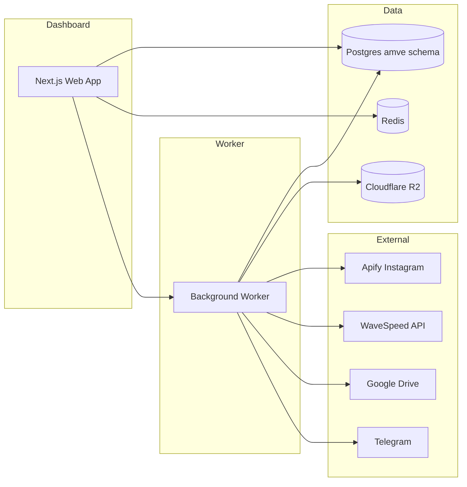

# AMVE — Software Handover Documentation

**Product:** Creatr AI Motion Video Engine (AMVE)  
**Version:** v1.4.0 (production handover)  
**Author:** Developer handover pack  
**Date:** June 2026  
**Production URL:** https://creatr-motion-engine-web-production.up.railway.app

---

## 1. Executive summary

AMVE is Creatr’s **internal production engine** for turning Instagram reels into **9:16 AI motion videos** using registered virtual influencer identities.

An operator can:

1. Register model face references  
2. Ingest Instagram source reels (Apify)  
3. Preview and select reels in the dashboard  
4. Queue batches (model × reel combinations)  
5. Monitor pipeline progress, costs, and exceptions  
6. Receive finished MP4s in **Google Drive** and alerts in **Telegram**

This document is the **primary handover guide** for presenting the software and source code to Oliver. It covers what was built, how to access it, how it works, and where to find deeper technical references.

**Operator walkthrough:** [TUTORIAL.md](./TUTORIAL.md) — step-by-step guide for running AMVE day to day.

---

## 2. What was delivered

| Area | Delivered |
|------|-----------|
| **Pipeline** | Ingestion → image generation (WaveSpeed chain) → QC → video (Kling) → QC → R2 storage → Google Drive delivery |
| **Dashboard** | Overview, Models, Sources, Prompts, Batch Builder, Queue & Runs, Exceptions, Audit, Run Detail |
| **Models** | Hazel, Amber, Mia — each with ≥3 face references |
| **Live acceptance** | **10 reels** delivered to Google Drive (~**$7** live spend, ~**70¢**/clip) |
| **Batch operations** | Pause, resume, retry failed, spend cap, concurrency limits |
| **Security** | Login page, admin/operator RBAC, Redis rate limits |
| **Observability** | Health API, Sentry, structured worker logs, Telegram alerts |
| **Documentation** | This pack + runbook, deploy guide, env reference |

**Out of scope for v1:** public SaaS, custom domain (optional later), consumer-facing signup.

---

## 3. Production access

| Item | Value |
|------|--------|
| **Dashboard** | https://creatr-motion-engine-web-production.up.railway.app |
| **Login page** | `/login` (redirects from `/` when not signed in) |
| **Health (public)** | `/api/health` — no login required |
| **Admin login** | Username `admin` (or `amve`) + `DASHBOARD_PASSWORD` |
| **Operator login** | Username `operator` + `OPERATOR_PASSWORD` (optional; set on Railway web service) |

**Google Drive output**

- Shared drive: **AMVE Deliveries**  
- Folder ID: `0AN6qzR_YR3VeUk9PVA`  
- File path pattern: `{modelSlug}/{reelShortcode}/run-{id}-final.mp4`  
- Example: `hazel/CqqVwIvghxz/run-27-final.mp4`

**Telegram:** delivery and exception alerts to the Creatr Content Engine group.

Passwords and service account JSON are shared **out of band** (1Password, etc.). Never commit `.env` or secrets to git.

---

## 4. System architecture



**Two Railway services:**

| Service | Role |
|---------|------|
| **web** | Next.js dashboard + REST API |
| **worker** | Polls Postgres job queue, executes pipeline runs (`WORKER_LOOP=true`) |

**Execution flow (queued mode):**

1. Operator queues a batch or run from the dashboard  
2. Postgres `run_jobs` row created  
3. Worker claims job, executes stages, writes `stage_runs` + assets to R2  
4. On success, MP4 uploaded to Drive; Telegram notified  
5. On failure, exception row created; operator can retry from dashboard  

---

## 5. Source code structure

```
ai-motion-video-engine/
├── apps/
│   ├── web/          # Next.js dashboard + API routes
│   └── worker/       # Background job processor
├── packages/
│   ├── db/           # Drizzle schema, migrations (Postgres `amve` schema)
│   ├── pipeline/     # Ingestion, providers, delivery, repositories
│   └── shared/       # Env validation, provider registry, types
├── docs/             # All handover and operator documentation
├── logo/             # Brand assets
├── design-reference/ # UI reference (not production code)
├── ig.txt            # Seed list of Instagram handles
└── .env.example      # Environment template (copy to .env)
```

**Key entry points**

| Path | Purpose |
|------|---------|
| `apps/web/app/(dashboard)/` | Dashboard pages |
| `apps/web/app/api/` | REST API |
| `apps/web/middleware.ts` | Auth + RBAC |
| `packages/pipeline/src/runs/execute-run.ts` | Core pipeline orchestration |
| `apps/worker/src/index.ts` | Worker loop |

---

## 6. Dashboard guide

### Overview
System health, KPIs (delivered runs, exceptions, queue, cost), provider readiness, recent runs.

### Model Registry
Register virtual influencers; upload ≥3 face reference images to R2. Required before any run.

### Instagram Ingestion (Sources)
- Add Instagram handles  
- Scrape reels via Apify (MP4 + first frame to R2)  
- Preview grid: select reels for batch building  
- Admin: delete test accounts (trash icon)

### Prompt Operations
View and activate image/video prompt templates. **Admin only** for activation.

### Batch Builder
Select model(s) + reel(s), review estimated cost, queue batch. **Admin only** for dispatch.

### Queue & Runs
- **Jobs strip** — Postgres queue (process next, retry stuck jobs)  
- **Master–detail ledger** — search/filter runs, inline trace, previews, prompt payload  
- Deep link: `/queue?run=27`

### Exception Center
Filter by status/stage; retry run, resolve, or dismiss. Open exceptions pulse in sidebar.

### System Audit Logs
Immutable log of operator actions (batch pause, prompt activate, etc.).

### Run Detail (`/runs/[id]`)
Full trace: stages, assets, delivery path, exceptions, audit.

### Appearance
**Lavender** / **Dark** theme — selectable on login page and sidebar toggle. Preference persists in browser.

---

## 7. Standard operator workflow

```
Register model refs → Add IG account → Scrape intake → Select reels
       → Build batch → Worker processes → Monitor Queue
       → Verify Drive MP4 → Handle exceptions if any
```

**Typical batch (overnight):**

1. Sources → scrape 3 reels per account  
2. Select best reels in preview grid  
3. Batch Builder → 1 model × N reels (or 3 models × 5 reels for stress)  
4. Confirm worker is running on Railway  
5. Morning: Queue → filter **delivered** / **failed**; retry failures  

---

## 8. Roles and permissions

| Role | Login | Permissions |
|------|-------|-------------|
| **Admin** | `admin` + `DASHBOARD_PASSWORD` | Full access: prompts, models, batch dispatch, delete accounts, all API routes |
| **Operator** | `operator` + `OPERATOR_PASSWORD` | View, intake, queue monitoring, exception handling, re-delivery — **no** batch dispatch or prompt activation |

API scripts can still use HTTP Basic Auth: `curl -u admin:PASSWORD ...`

---

## 9. Infrastructure

| Component | Provider | Notes |
|-----------|----------|-------|
| Hosting | Railway | Web + worker services |
| Database | Railway Postgres | Schema: `amve` (isolated) |
| Object storage | Cloudflare R2 | Source MP4s, frames, generated assets |
| Rate limiting | Redis | Railway Redis or Upstash |
| Error monitoring | Sentry | `SENTRY_DSN` on web + worker |

See [DEPLOY-RAILWAY.md](./DEPLOY-RAILWAY.md) for deploy steps and [ENVIRONMENT.md](./ENVIRONMENT.md) for all variables.

**Production env highlights:**

```env
NODE_ENV=production
RUN_EXECUTION_MODE=queued
WORKER_LOOP=true
ASSET_STORAGE_MODE=r2
INGESTION_PROVIDER_MODE=api
IMAGE_PROVIDER_MODE=api
VIDEO_PROVIDER_MODE=api
DASHBOARD_PASSWORD=<secret>
OPERATOR_PASSWORD=<optional>
REDIS_URL=<redis-url>
WAVESPEED_MAX_CONCURRENT_JOBS=2
DAILY_SPEND_CAP_CENTS=50000
DRIVE_ROOT_FOLDER_ID=0AN6qzR_YR3VeUk9PVA
DRIVE_SA_JSON_BASE64=<base64-service-account>
TELEGRAM_BOT_TOKEN=<token>
TELEGRAM_CHAT_ID=<chat-id>
```

---

## 10. Local development

```bash
corepack pnpm install
cp .env.example .env          # fill DATABASE_URL, keys, etc.
corepack pnpm db:migrate
corepack pnpm db:seed         # providers, prompts, Hazel, ig.txt handles
corepack pnpm dev             # http://localhost:3000
corepack pnpm worker:dev      # separate terminal, if RUN_EXECUTION_MODE=queued
```

**Verify:**

```bash
corepack pnpm build && corepack pnpm test
corepack pnpm test:delivery   # Drive + Telegram smoke test
curl http://localhost:3000/api/health | jq
```

Full local guide: [LOCAL-DEV.md](./LOCAL-DEV.md)

---

## 11. Monitoring and health

```bash
curl -s https://creatr-motion-engine-web-production.up.railway.app/api/health | jq
```

| Component | Production expectation |
|-----------|------------------------|
| database | ok |
| storage (R2) | ok |
| ffmpeg | ok |
| delivery (Drive) | ok |
| telegram | ok |
| ingestion / image / video | ok (live API mode) |

**Sentry test (admin, after login cookie or Basic auth):**

```bash
curl -u admin:PASSWORD -X POST \
  https://creatr-motion-engine-web-production.up.railway.app/api/admin/sentry-test
```

---

## 12. Troubleshooting

| Symptom | Action |
|---------|--------|
| Jobs stuck queued | Check Railway worker service active; restart worker |
| Run failed | Queue → select run → read error; retry job or run |
| Drive upload failed | Verify SA has Editor on Shared Drive; check `/api/health` delivery |
| Apify intake empty | Check `APIFY_TOKEN`, account handle, rate limits |
| WaveSpeed rejection | Content policy — try different reel/model combo |
| Stale running job | Queue → Retry job (lock expires after 90 min without heartbeat) |

Full procedures: [RUNBOOK.md](./RUNBOOK.md)

---

## 13. Acceptance evidence

**10 live reels delivered** (June 2026). Full table: [DAY-11-COMPLETION.md](./DAY-11-COMPLETION.md)

| Run | Model | Reel shortcode |
|-----|-------|----------------|
| 16–20 | Hazel | various |
| 21 | Amber | DZgrCBLtv5_ |
| 22 | Mia | CqqVwIvghxz |
| 23 | Amber | DZdSY-jtLYA |
| 25 | Hazel | CqqVwIvghxz |
| 27 | Mia | DZdSY-jtLYA |

**Re-delivery:** idempotent — same Drive file ID on retry (`POST /api/runs/{id}/redeliver`).

**Stress batch #7:** 15 runs (5 reels × 3 models) — batch pause/resume verified.

---

## 14. Handover presentation agenda (suggested)

Use this outline when walking Oliver through the software:

1. **5 min** — What AMVE does (Section 1–2)  
2. **5 min** — Live demo: login → Overview health → Queue master–detail on a delivered run  
3. **5 min** — Operator workflow: Sources → Batch Builder → Drive folder  
4. **5 min** — Exceptions + retry; Telegram alert  
5. **5 min** — Source code tour: monorepo structure, worker + pipeline  
6. **5 min** — Deploy, env vars, runbook, support contacts  
7. **Q&A** — Hand over repo access + password doc  

---

## 15. Source code handover checklist

- [ ] Git repository access granted (GitHub: `creatr-motion-engine`)  
- [ ] Railway project access (web + worker + Postgres + Redis)  
- [ ] Cloudflare R2 bucket access  
- [ ] Google Drive SA JSON (or base64 env var documented)  
- [ ] Apify + WaveSpeed account access (or keys rotated to Oliver)  
- [ ] Telegram bot admin access  
- [ ] `DASHBOARD_PASSWORD` + optional `OPERATOR_PASSWORD` shared securely  
- [ ] This document + [OLIVER-ACCESS.md](./OLIVER-ACCESS.md) reviewed  
- [ ] Oliver completes first-session checklist (Section 3 + Dashboard guide)  

---

## 16. Documentation index

| Document | Audience | Purpose |
|----------|----------|---------|
| **SOFTWARE-HANDOVER.md** (this file) | Oliver / stakeholders | Presentation + complete handover |
| [OLIVER-ACCESS.md](./OLIVER-ACCESS.md) | Oliver | Quick access card |
| [HANDOFF.md](./HANDOFF.md) | Operator | Feature summary + demo checklist |
| [RUNBOOK.md](./RUNBOOK.md) | Operator | Recovery procedures |
| [DEPLOY-RAILWAY.md](./DEPLOY-RAILWAY.md) | DevOps | Deploy and infra |
| [ENVIRONMENT.md](./ENVIRONMENT.md) | Developer | All env vars |
| [LOCAL-DEV.md](./LOCAL-DEV.md) | Developer | Local setup |
| [DAY-11-COMPLETION.md](./DAY-11-COMPLETION.md) | Stakeholder | Acceptance sign-off evidence |
| [FROM_SCRATCH_TECHNICAL_SPEC.md](./FROM_SCRATCH_TECHNICAL_SPEC.md) | Developer | Deep technical spec |
| [WORK-PLAN.md](./WORK-PLAN.md) | Developer | Build history (Days 1–11) |

---

## 17. Maintenance notes

- **Deploy:** push to `master` → Railway auto-deploys web + worker  
- **Migrations:** run `pnpm db:migrate` against production `DATABASE_URL` before deploy if schema changed  
- **Secrets:** rotate via Railway env vars; never commit  
- **Costs:** WaveSpeed ~70¢/delivered clip; Apify per scrape; monitor `DAILY_SPEND_CAP_CENTS`  
- **Backups:** enable Railway Postgres snapshots; see RUNBOOK  

---

## 18. Optional future enhancements (v1.1)

Not required for v1 acceptance; documented for roadmap:

- Custom domain on Railway  
- Delete individual reels from Sources queue  
- QC metrics broken down by prompt version / provider / model  
- Loom walkthrough video for operators  

---

*End of software handover documentation.*
